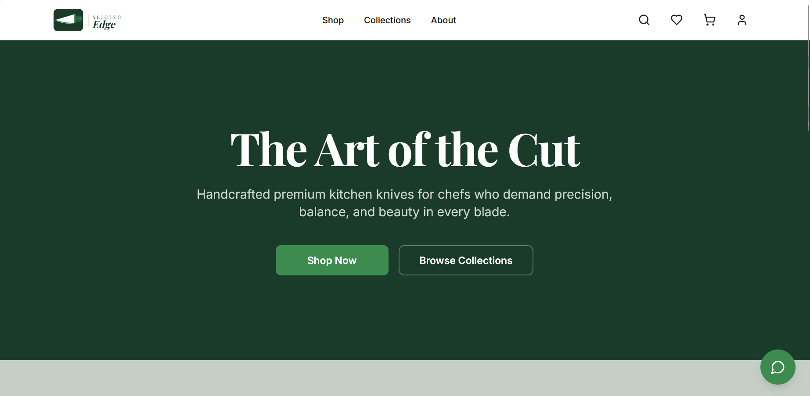
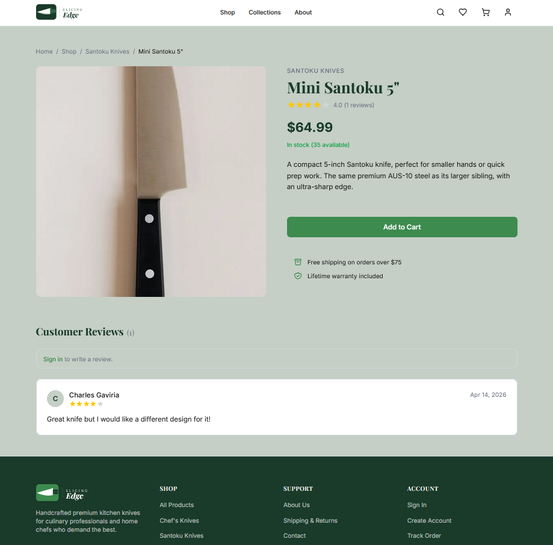
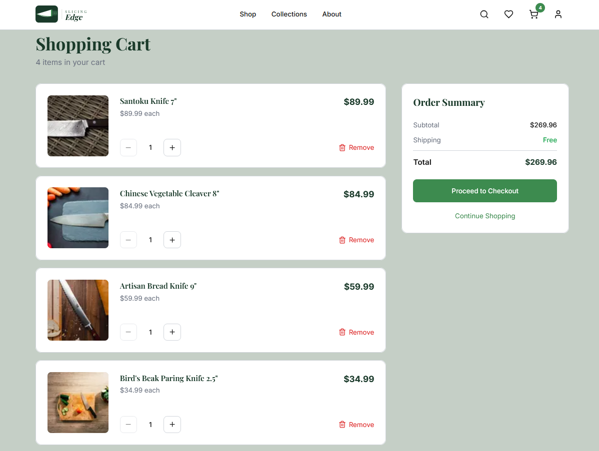
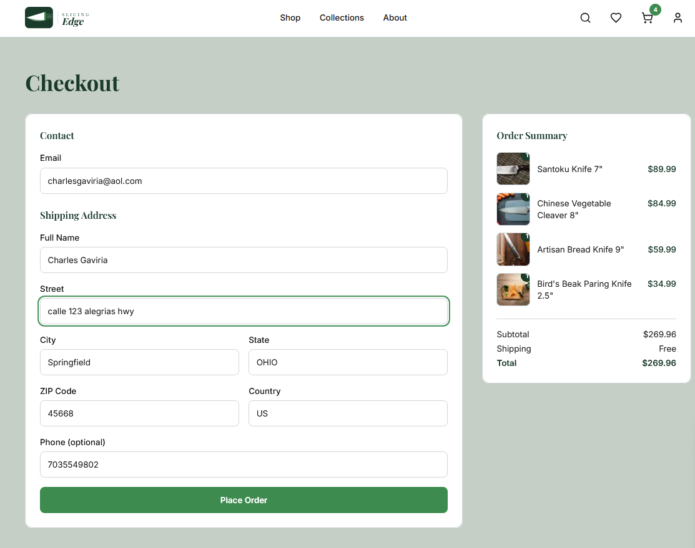

# Slicing Edge

> Premium kitchen knife e-commerce platform — portfolio-grade, full-stack monorepo.

**Live demo:** `https://slicing-edge.vercel.app` &nbsp;|&nbsp; **API docs (Swagger):** `https://<railway-api-url>/docs`

---

## Tech Stack

| Layer | Technology |
|-------|-----------|
| Frontend | Next.js 15 (App Router), React 19, TypeScript, Tailwind CSS v4 |
| Backend | Fastify 5, TypeScript, Prisma ORM, PostgreSQL |
| Auth | Auth.js v5 — email/password + Google OAuth, JWT strategy |
| Payments | Stripe Checkout Sessions + Webhooks + Stripe Tax |
| Email | Resend + React Email |
| Images | Local file storage (`public/uploads/`) served by Fastify + Next.js `<Image>` |
| AI Chatbot | Groq API — Llama 3.3 70B, tool-use pattern (server-side only) |
| Rate Limiting | Upstash Redis + `@upstash/ratelimit` |
| Testing | Vitest, React Testing Library, Playwright (E2E) |
| Monorepo | Turborepo + npm workspaces |
| CI/CD | GitHub Actions → Railway (API) + Vercel (Web) |

---

## Monorepo Structure

```
slicing-edge/
├── apps/
│   ├── web/          # Next.js 15 frontend  → Vercel
│   └── api/          # Fastify 5 REST API   → Railway
├── packages/
│   ├── db/           # Prisma schema, client, migrations, seed
│   ├── shared/       # Zod schemas, constants, shared types
│   ├── email/        # React Email templates + Resend helper
│   └── config/       # Shared TypeScript configs
├── docs/
│   └── engineering/  # ROADMAP, DEPLOY guide, ENV reference, notes
└── .github/
    └── workflows/    # CI/CD pipeline (deploy.yml)
```

---

## Features

- **Storefront** — product listing with filters, full-text search, product detail pages, category browsing
- **Cart** — guest cart (sessionId) + authenticated cart, Zustand store with localStorage persistence
- **Checkout** — guest + authenticated flows, Stripe Checkout redirect, webhook-confirmed order creation, order confirmation email
- **Order tracking** — guest tracking by order number + email; authenticated order history under `/account/orders`
- **Auth** — register with email verification, login, Google OAuth, forgot/reset password
- **Wishlist** — toggle add/remove per product, persistent per authenticated user
- **Reviews** — star rating + comment, per-product pagination, delete own review or admin delete
- **Account** — profile page with saved address; order history feed
- **Admin panel** — product CRUD (create/edit/deactivate) with local image upload (multipart, up to 10 MB, stored in `public/uploads/`), order status management with email notification on ship, user role management, metrics dashboard (KPIs + 30-day orders chart + low-stock list)
- **AI Chatbot** — floating widget (bottom-right) powered by Groq AI (Llama 3.3 70B); tools: search products, recommend by category, track order
- **Transactional emails** — Welcome, Password Reset, Order Confirmation, Shipped Notification (Resend + React Email)
- **SEO** — `sitemap.xml`, `robots.txt`, OG images, JSON-LD structured data on product pages
- **Accessibility** — WCAG 2.1 AA: aria labels, focus rings, min 44×44px touch targets, color-contrast compliant palette
- **Security** — CSP headers, Helmet, Upstash rate limiting, XSS-safe input handling, no client-side secrets
- **Testing** — Vitest unit + integration (backend), React Testing Library + Vitest (frontend), Playwright E2E suite

---

## Local Development

### Prerequisites

- Node.js ≥ 20
- npm ≥ 10
- PostgreSQL (local instance or remote URL)

### 1. Clone and install

```bash
git clone https://github.com/hervid2/slicing_edge.git
cd slicing_edge
npm install
```

### 2. Configure environment variables

```bash
cp .env.example .env
cp apps/api/.env.example apps/api/.env
cp apps/web/env.local.example apps/web/.env.local
```

Fill in each file with your keys. See [Environment Variables reference](docs/engineering/ENV.md).

### 3. Set up the database

```bash
npm run db:generate      # generate Prisma client
npm run db:push          # push schema (dev — no migration files)
npm run db:seed          # seed with sample products and admin user
```

### 4. Start dev servers

```bash
npm run dev              # starts API on :3001 and Web on :3000 concurrently
```

| Service | URL |
|---------|-----|
| Web storefront | http://localhost:3000 |
| API | http://localhost:3001 |
| Swagger UI | http://localhost:3001/docs |

### Test accounts (after seed)

| Role | Email | Password |
|------|-------|----------|
| Admin | admin@slicing-edge.com | admin123456 |
| Customer | customer@example.com | customer123456 |

### Stripe local webhook

```bash
stripe listen --forward-to http://localhost:3001/api/checkout/webhook
```

Test cards: `4242 4242 4242 4242` (success) · `4000 0000 0000 0002` (declined)

---

## Deploy to Production

Full step-by-step guide: [docs/engineering/DEPLOY.md](docs/engineering/DEPLOY.md)

### Infrastructure at a glance

```
Vercel (Next.js web)
        │
        │ HTTPS/REST
        ▼
Railway (Fastify API) ──► Railway PostgreSQL
        │
        ├──► local /uploads/ (product images, served as static files)
        ├──► Stripe (payments + webhooks)
        ├──► Resend (email)
        ├──► Upstash Redis (rate limiting)
        └──► Groq AI (AI chatbot)
```

### Deployment platforms

| Service | Platform | Auto-deploy trigger |
|---------|----------|-------------------|
| `apps/web` | Vercel | Push to `main` (GitHub integration) |
| `apps/api` | Railway | Push to `main` (`railway.toml` + Dockerfile) |
| Database | Railway PostgreSQL or Neon | Manual provision |

### Quick deploy checklist

1. **Database** — provision PostgreSQL on Railway, copy `DATABASE_URL`
2. **API** — create Railway service, set all env vars (see [ENV.md](docs/engineering/ENV.md))
3. **Web** — import repo to Vercel, set all env vars
4. **Migrate + seed** — `npm run db:migrate:deploy && npm run db:seed:prod`
5. **Stripe webhook** — register `https://<api-url>/api/checkout/webhook` in Stripe Dashboard
6. **Push to `main`** — CI pipeline runs: test → build → deploy API → deploy Web → smoke test

---

## CI/CD Pipeline

Defined in [.github/workflows/deploy.yml](.github/workflows/deploy.yml):

```
push to main
  ├── test      (Vitest — unit + integration)
  ├── build     (turbo build)
  ├── deploy-api   (Railway CLI)
  ├── deploy-web   (Vercel CLI)
  └── smoke-test   (scripts/smoke-test.sh)
```

Required GitHub Actions secrets: `RAILWAY_TOKEN`, `VERCEL_TOKEN`, `VERCEL_ORG_ID`, `VERCEL_PROJECT_ID`, `DATABASE_URL`.

---

## Scripts Reference

| Command | Description |
|---------|-------------|
| `npm run dev` | Start all apps in development mode |
| `npm run build` | Build all packages and apps |
| `npm run lint` | ESLint across monorepo |
| `npm run type-check` | TypeScript check across monorepo |
| `npm run format` | Prettier format all `.ts/.tsx/.md/.json` |
| `npm run db:generate` | Generate Prisma client from schema |
| `npm run db:push` | Push schema to DB without migration files (dev) |
| `npm run db:migrate:deploy` | Apply pending migrations (production) |
| `npm run db:seed` | Seed development data |
| `npm run db:seed:prod` | Seed production data (real images) |

---

## Design System

| Token | Value |
|-------|-------|
| Primary | `#1A3A2A` — deep forest green |
| Primary Light | `#2D5A3F` |
| Accent / CTA | `#3D8B4F` — vibrant green |
| Background | `#C5CFC6` — sage green |
| Heading font | Playfair Display (serif) |
| Body font | Inter (sans-serif) |

---

## Screenshots

### Home


### Product Detail


### Cart


### Checkout


---

## Engineering Docs

| Document | Description |
|----------|-------------|
| [agent.md](agent.md) | Stack, architecture, code conventions |
| [docs/engineering/ROADMAP.md](docs/engineering/ROADMAP.md) | 25-day implementation roadmap |
| [docs/engineering/DEPLOY.md](docs/engineering/DEPLOY.md) | Full production deploy guide |
| [docs/engineering/ENV.md](docs/engineering/ENV.md) | Environment variables reference |
| [docs/engineering/README.md](docs/engineering/README.md) | Engineering guidelines index |

---

## License

MIT — built for portfolio purposes. Not affiliated with any real brand.
